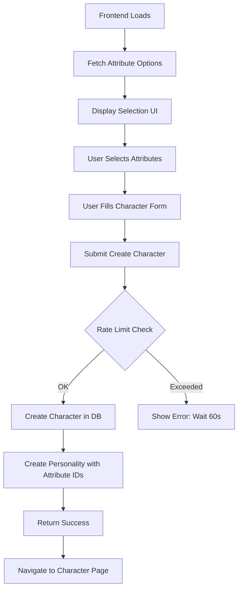

# Frontend API Integration Workflow - Nova AI

Complete guide for implementing character creation with new attribute collections (Occupation, Hobby, Relationship, Fetish).

---

## 🎯 Overview

**New Collections Created:**
- `characteroccupations` - 26 predefined options
- `characterhobbies` - 26 predefined options
- `characterrelationships` - 25 predefined options
- `characterfetishes` - 26 predefined options

**Base URL:** `http://localhost:8088/api/v1`

---

## 📋 Step-by-Step Workflow

### Step 1: Fetch Attribute Options

**Purpose:** Load all predefined options for dropdowns/selection UI

#### API Endpoints (Need to Create)

```javascript
// GET all occupations
GET /api/v1/attributes/occupations

// GET all hobbies
GET /api/v1/attributes/hobbies

// GET all relationships
GET /api/v1/attributes/relationships

// GET all fetishes
GET /api/v1/attributes/fetishes
```

#### Expected Response Format

```json
{
  "success": true,
  "data": [
    {
      "_id": "6756abc123...",
      "name": "Teacher",
      "emoji": "👩‍🏫",
      "isCustom": false
    },
    {
      "_id": "6756abc124...",
      "name": "Doctor",
      "emoji": "👨‍⚕️",
      "isCustom": false
    }
    // ... more options
  ]
}
```

#### Frontend Implementation

```javascript
// Fetch all attribute options on component mount
const fetchAttributeOptions = async () => {
  try {
    const [occupations, hobbies, relationships, fetishes] = await Promise.all([
      fetch('http://localhost:8088/api/v1/attributes/occupations'),
      fetch('http://localhost:8088/api/v1/attributes/hobbies'),
      fetch('http://localhost:8088/api/v1/attributes/relationships'),
      fetch('http://localhost:8088/api/v1/attributes/fetishes')
    ]);

    const occupationsData = await occupations.json();
    const hobbiesData = await hobbies.json();
    const relationshipsData = await relationships.json();
    const fetishesData = await fetishes.json();

    // Store in state
    setOccupations(occupationsData.data);
    setHobbies(hobbiesData.data);
    setRelationships(relationshipsData.data);
    setFetishes(fetishesData.data);
  } catch (error) {
    console.error('Error fetching attributes:', error);
  }
};
```

---

### Step 2: Display Selection UI

**UI Components Needed:**

```jsx
// Occupation Selector
<SelectionGrid>
  {occupations.map(occupation => (
    <SelectionCard
      key={occupation._id}
      selected={selectedOccupation === occupation._id}
      onClick={() => setSelectedOccupation(occupation._id)}
    >
      <span>{occupation.emoji}</span>
      <span>{occupation.name}</span>
    </SelectionCard>
  ))}
</SelectionGrid>

// Same pattern for Hobby, Relationship, Fetish
```

**State Management:**

```javascript
const [selectedOccupation, setSelectedOccupation] = useState(null);
const [selectedHobby, setSelectedHobby] = useState(null);
const [selectedRelationship, setSelectedRelationship] = useState(null);
const [selectedFetish, setSelectedFetish] = useState(null);
```

---

### Step 3: Create Character with Attributes

#### API Endpoint

```javascript
POST /api/v1/characters
```

**Headers:**
```javascript
{
  "Authorization": "Bearer YOUR_ACCESS_TOKEN",
  "Content-Type": "application/json"
}
```

#### Request Body

```json
{
  "name": "Emma Watson",
  "age": 25,
  "gender": "Female",
  "description": "A smart and witty teacher...",
  "shortDescription": "Your favorite teacher",
  "displayImageUrls": ["https://..."],
  
  "personality": {
    "personality": "Friendly and intelligent",
    "personalityDetails": "Loves teaching and helping students",
    "voice": "Sweet",
    "occupationId": "6756abc123...",      // Selected occupation ID
    "hobbyId": "6756def456...",           // Selected hobby ID
    "relationshipId": "6756ghi789...",    // Selected relationship ID
    "fetishId": "6756jkl012..."           // Selected fetish ID
  }
}
```

#### Frontend Implementation

```javascript
const createCharacter = async (characterData) => {
  try {
    const response = await fetch('http://localhost:8088/api/v1/characters', {
      method: 'POST',
      headers: {
        'Authorization': `Bearer ${accessToken}`,
        'Content-Type': 'application/json'
      },
      body: JSON.stringify({
        name: characterData.name,
        age: characterData.age,
        gender: characterData.gender,
        description: characterData.description,
        shortDescription: characterData.shortDescription,
        displayImageUrls: characterData.images,
        
        personality: {
          personality: characterData.personality,
          personalityDetails: characterData.personalityDetails,
          voice: characterData.voice,
          occupationId: selectedOccupation,      // From state
          hobbyId: selectedHobby,                // From state
          relationshipId: selectedRelationship,  // From state
          fetishId: selectedFetish               // From state
        }
      })
    });

    const result = await response.json();
    
    if (result.success) {
      console.log('Character created:', result.data);
      // Navigate to character page or show success
    } else {
      console.error('Error:', result.message);
    }
  } catch (error) {
    console.error('Error creating character:', error);
  }
};
```

---

### Step 4: Handle Rate Limiting

**Rate Limits:**
- Create Character: **5 requests per minute per user**
- Update Character: **10 requests per minute per user**

#### Error Handling

```javascript
const createCharacter = async (characterData) => {
  try {
    const response = await fetch('http://localhost:8088/api/v1/characters', {
      method: 'POST',
      headers: {
        'Authorization': `Bearer ${accessToken}`,
        'Content-Type': 'application/json'
      },
      body: JSON.stringify(characterData)
    });

    const result = await response.json();

    // Handle rate limit error
    if (response.status === 429) {
      const retryAfter = result.retryAfter || 60; // seconds
      alert(`Too many requests! Please wait ${retryAfter} seconds.`);
      return;
    }

    if (result.success) {
      console.log('Character created:', result.data);
    }
  } catch (error) {
    console.error('Error:', error);
  }
};
```

---

### Step 5: Fetch Character with Populated Attributes

#### API Endpoint

```javascript
GET /api/v1/characters/:id?populate=personality
```

#### Response Format

```json
{
  "success": true,
  "data": {
    "_id": "6756xyz...",
    "name": "Emma Watson",
    "age": 25,
    "gender": "Female",
    "personality": {
      "_id": "6756abc...",
      "personality": "Friendly and intelligent",
      "occupationId": {
        "_id": "6756...",
        "name": "Teacher",
        "emoji": "👩‍🏫"
      },
      "hobbyId": {
        "_id": "6756...",
        "name": "Reading",
        "emoji": "📚"
      },
      "relationshipId": {
        "_id": "6756...",
        "name": "Friend",
        "emoji": "👫"
      },
      "fetishId": {
        "_id": "6756...",
        "name": "Vanilla",
        "emoji": "🍦"
      }
    }
  }
}
```

---

## 🔧 Required Backend APIs (To Be Created)

You need to create these controller endpoints:

### 1. Attributes Controller

**File:** `src/controllers/attributes.controllers.js`

```javascript
// GET /api/v1/attributes/occupations
exports.getAllOccupations = async (req, res) => {
  const occupations = await CharacterOccupation.find().sort({ name: 1 });
  res.json({ success: true, data: occupations });
};

// GET /api/v1/attributes/hobbies
exports.getAllHobbies = async (req, res) => {
  const hobbies = await CharacterHobby.find().sort({ name: 1 });
  res.json({ success: true, data: hobbies });
};

// GET /api/v1/attributes/relationships
exports.getAllRelationships = async (req, res) => {
  const relationships = await CharacterRelationship.find().sort({ name: 1 });
  res.json({ success: true, data: relationships });
};

// GET /api/v1/attributes/fetishes
exports.getAllFetishes = async (req, res) => {
  const fetishes = await CharacterFetish.find().sort({ name: 1 });
  res.json({ success: true, data: fetishes });
};
```

### 2. Attributes Routes

**File:** `src/routes/attributes.routes.js`

```javascript
const express = require('express');
const router = express.Router();
const attributesController = require('../controllers/attributes.controllers');

router.get('/occupations', attributesController.getAllOccupations);
router.get('/hobbies', attributesController.getAllHobbies);
router.get('/relationships', attributesController.getAllRelationships);
router.get('/fetishes', attributesController.getAllFetishes);

module.exports = router;
```

### 3. Register Routes in index.js

```javascript
const attributesRoutes = require('./routes/attributes.routes');
app.use('/api/v1/attributes', attributesRoutes);
```

---

## 📊 Complete Flow Diagram



---

## ✅ Checklist for Frontend Developer

- [ ] Create attributes API service file
- [ ] Fetch all attribute options on app load
- [ ] Create selection UI components (4 grids)
- [ ] Implement state management for selected attributes
- [ ] Update character creation form to include attribute IDs
- [ ] Handle rate limiting errors (429 status)
- [ ] Test create character flow end-to-end
- [ ] Implement character display with populated attributes

---

## 🚨 Important Notes

1. **Authentication Required**: All create/update APIs need `Authorization: Bearer TOKEN`
2. **Rate Limiting**: Show user-friendly messages when limit exceeded
3. **Validation**: Ensure all required fields are filled before submission
4. **Error Handling**: Handle network errors, validation errors, and rate limits
5. **Loading States**: Show loading indicators during API calls

---

## 🎨 UI Reference

Your UI screenshots show:
- Grid layout with emoji + name
- Selected state with border/highlight
- "Custom" and "None" options at top
- Clean, modern dark theme

Match this design in your frontend implementation!
